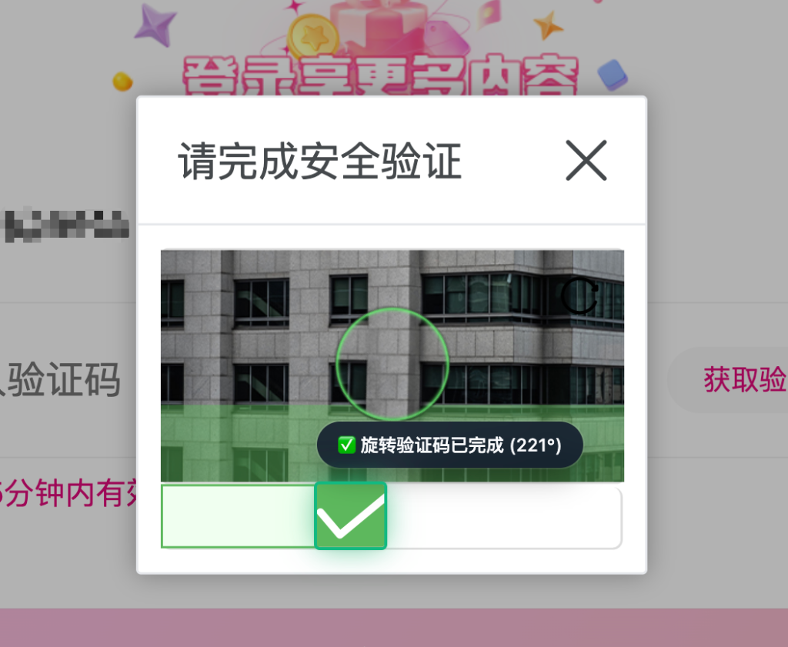
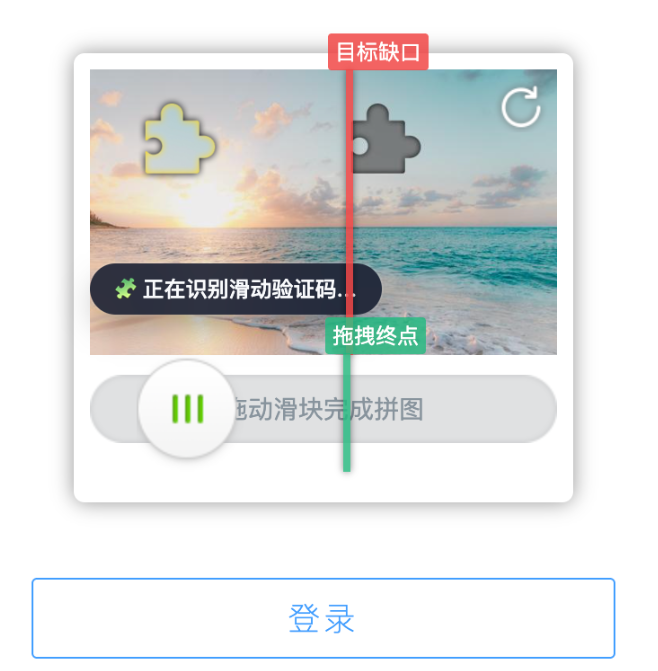
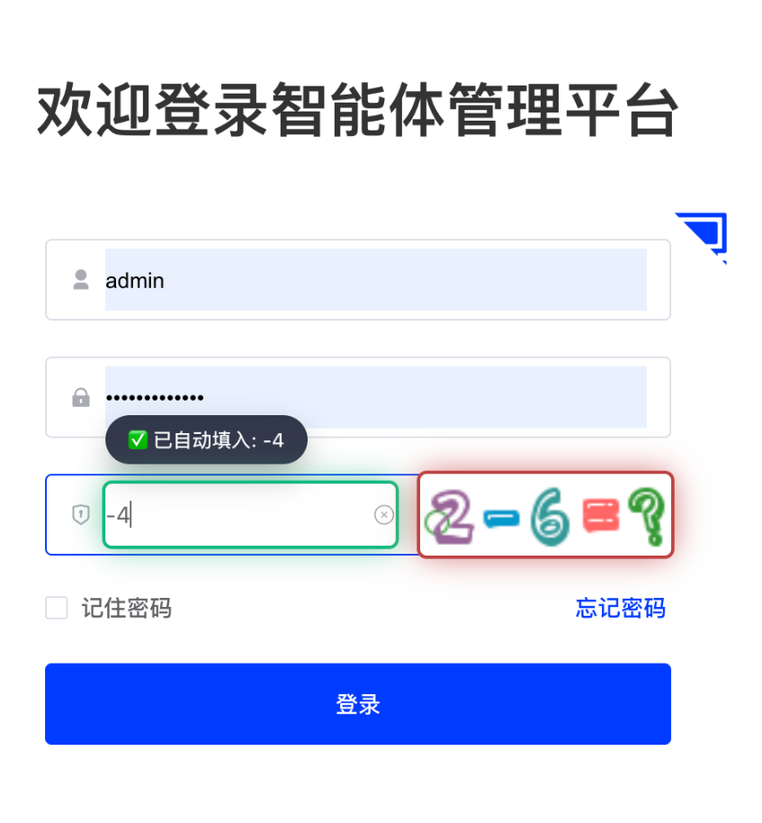

# 验证码自动识别助手 (CaptchaAutoSolver) v3.0

> 基于多维图像特征比对与本地极速引擎的验证码自动识别工具。支持**三维融合算法的旋转检测**、**滑动拼图验证码**与**高精度 OCR 识别**。引入全新**自适应记忆校准与学习系统**，0延迟、0干预、100%保护隐私，无缝为你省下每一次敲击与拖拽的时间。

  
  
   
  
  
  

## ✨ 核心特性

- **🌐 严格域名白名单管控**：内置一键添加当前域名至白名单功能。默认不在未授权的网站启动，绝不干扰您的日常网页浏览，做到绝对克制。
- **🤖 全自动无感识别与操作**：智能扫描网页中的复杂验证码组件，极速定位目标元素。自动计算正确答案并模拟最逼真的人类拖拽交互。
- **🌀 独创的三维融合共识旋转检测**：针对高难度旋转验证码，全面升级为 `V1 极坐标 ZNCC` + `V2 边缘方差` + `V3 色彩环 ZNCC` 三引擎并发！基于“归一化置信度加权融合（Weighted Fusion）”策略，无视严重噪点与虚假边缘。
- **🧠 自适应记忆与持续学习系统**：遇到极特殊干扰图形导致物理预测与服务器后台存在玄学偏差时，系统可后台自动进行多轮试探闭环。更提供直观的**可视化手工校准面板**，修正过一次的同类型图片（基于感知哈希），以后相遇将会自动叠加最佳偏移量，**实现越用越准**！
- **📏 严谨的物理与 DOM 上下文扫描探测**：彻底杜绝复杂网页、重载组件情况下的“张冠李戴”；独家引入“非透明像素物理扫描探测”，自动消除由于图片透明 Padding、组件边框引起的像素级误差，每一次滑动的物理换算都能达到绝对精度。
- **🧩 ZNCC 滑动缺口定位算法**：针对高光边缘、半透明拼图及深邃阴影，采用 **ZNCC（零均值归一化交叉相关）** + 两阶段领域精细提纯，免疫色彩与亮度干扰。
- **⚡️ 极速纯前端引擎**：基于 **ONNX Runtime Web (WASM + SIMD)** 深度优化文本 OCR 推理，结合纯 JavaScript 离屏 Canvas 高速图像特征匹配，识别速度达毫秒级。
- **🔒 100% 本地运行与隐私保护**：所有模型、视觉算法和推理引擎完全内置于浏览器离屏文档 (Offscreen Document) 中。**绝不发起任何外部网络请求**，彻底杜绝隐私数据外泄风险。
- **🪶 极致内存调度**：独创“按需唤醒”机制。在没有验证码的网页上占用 **0% CPU**；识别完成后闲置自动销毁推理引擎，**彻底释放后台内存**。
- **🎭 拟人化轨迹与强框架兼容**：拖拽模拟采用三段式贝塞尔缓动、随机 Y 轴抖动及微幅过冲回弹机制，完美绕过前端防风控拦截；底层深度适配 Vue / React / Element-UI 等单页应用。

## 📦 项目结构 (纯浏览器扩展)
- **`manifest.json`**: 遵循 Chrome Manifest V3 标准，严格遵循最小权限原则（无指纹暴露风险）。
- **`content.js`**: 核心前端逻辑。负责带有防抖与上下文约束的 DOM 智能扫描、Base64 提取、坐标换算、拟人拖拽模拟，以及自适应缓存的追踪读写。
- **`background.js`**: Service Worker 调度中枢。负责按需创建 Offscreen 文档以及闲置超时内存回收与跨文档通信。
- **`offscreen/`**: 内置独立推理环境。执行 ONNX OCR 解码，并行计算并调度图像边缘 ZNCC 特征匹配算法。
- **`options/`**: 用户交互与高级设置页，提供匹配规则、引擎控制开关与验证码自适应记忆的可视化校准工具。
- **`models/`**: 经过 INT8 高度动态量化压缩的 ONNX OCR 模型及字符字典。

---

## 🚀 快速开始

本项目已经彻底摆脱了传统的外部 Python 服务依赖，实现了开箱即用。

### 1. 安装 Chrome 扩展
1. 打开 Chrome/Edge 浏览器，进入扩展管理页面 `chrome://extensions/`
2. 开启右上角的 **“开发者模式”**
3. 点击 **“加载已解压的扩展程序”**，选择本项目文件夹即可。

### 2. 测试运行
1. **添加域名白名单**：打开需要识别验证码的网站，点击右上角插件图标，点击 **“➕ 一键添加当前域名至白名单”**（不添加白名单插件默认不工作）。
2. **旋转验证码**：当弹窗显示旋转验证码时，插件将自动寻找合法物理对齐的验证码组件，使用多引擎提取并融合最佳角度，精准反向旋转。
3. **滑动拼图验证码**：自动感知滑块与背景图、在后台极速计算缺口坐标，并模拟人类轨迹完成拖拽滑动校验。
4. **文本验证码**：访问带文本验证码的页面，扩展会自动截取图片并离线高度解码填入。

---

## 📖 功能操作手册

您可以通过点击浏览器右上角插件图标 (Popup)，或在扩展管理页面打开 **选项 (Options)**，进入核心控制面板。

### 一、 域名白名单管理 (必读)
> [!IMPORTANT]
> **新功能注意**：为了不干扰无关网页，扩展采用了严格的**白名单机制**。当白名单为空时，**任何网站都不会自动识别**。
- **快捷加入**：在有验证码的网页上点击扩展 Popup 面板中的“一键添加当前域名”。
- **完整管理**：进入选项页面，点击 **“🌐 域名白名单管理”** 选项卡，您可以查阅、手动添加或删除生效的域名。

### 二、 匹配规则与核心引擎配置
若目标网站的 DOM 嵌套过于冷门导致插件未能自动感知，您可在此页面填入 **自定义选择器 (CSS Selectors)**：
- **自定义图片/输入框**: 针对常规文本验证码。
- **自定义背景/滑块**: 针对滑块与拼图验证码。
- **引擎微调与数据收集**: 您可以随时开关并组合 V1/V2/V3 旋转识别引擎。同时也可随时启用或关闭底层的全埋点数据收集与试探功能（如不再需要自适应试探，可将其关闭以节省算力）。

### 三、 旋转验证码自适应记忆管理 (核心高阶功能)
针对少数有“视觉骗局”或计算偏移（比如网站后台真实目标角度跟前端计算出现玄学差值）的验证码。

1. **自动持续学习**：每当旋转验证码未通过验证，系统（若开启此功能）会自动进入“多次随机步长微调试探”。一旦某次试探意外成功，会将该图像的数字 Hash 与此试探偏差永久锁入本地库。
2. **人工可视化校准**：
   - 切换到 **[自适应记忆管理]** 标签页。您可以查看到所有曾经“交过手”的疑难图片和它们的修正量。
   - 找到识别存在偏差的记录，点击 **“🎨 可视化校准”**。
   - 在弹出的校准面板中，UI 展示全面采用了符合人类直觉的 **顺时针偏移系统**。
   - **操作方法**：直接在面板下方的拖拽条进行左右滑动，观察右侧预览大图，**直到中心图案正向朝上完美拼合**。
   - 面板会自动帮您换算底层复杂的反方向映射并给出直观提示。点击**“保存修改”**，一次校准后，以后再遇到此图都将精确闭环。

---
*保持纯粹，只为极致的浏览体验。*
